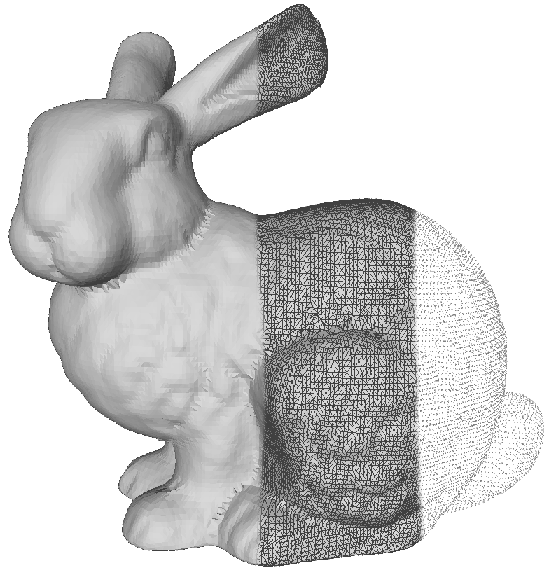

# Ball Pivoting Algorithm (BPA)

This is an exemplary C++ implementation of the ball pivoting algorithm for creating triangle meshes from point clouds.
The implementation is intentionally kept simple and is based on:

- *The Ball-Pivoting Algorithm for Surface Reconstruction* by Fausto Bernardini, Joshua Mittleman, Holly Rushmeier, Claudio Silva and Gabriel Taubin

The model of the bunny is provided by the [Stanford University Computer Graphics Laboratory](http://graphics.stanford.edu/data/3Dscanrep/).
